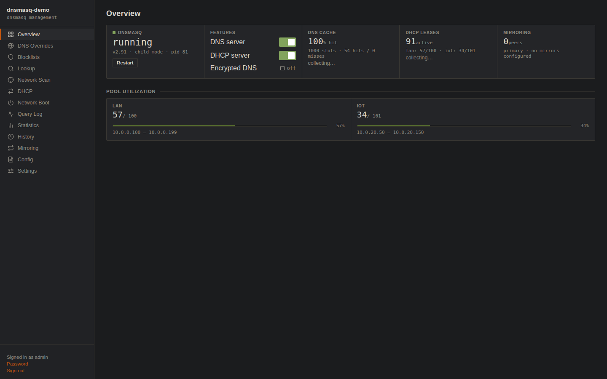
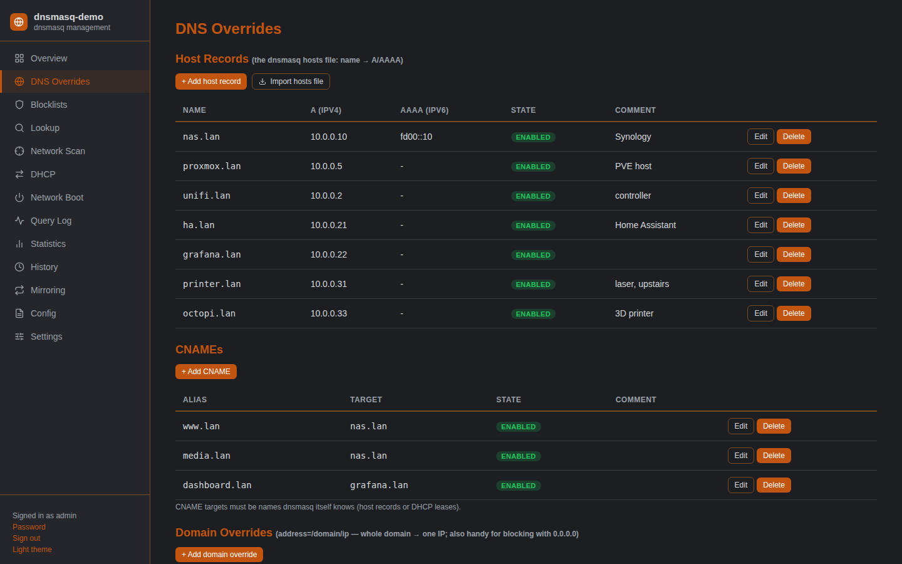
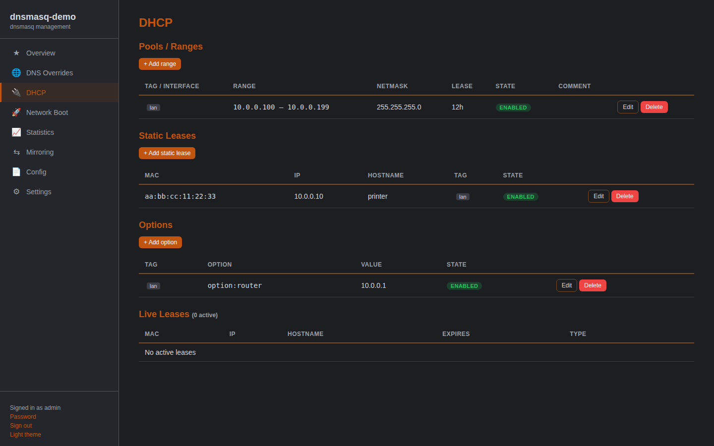

# Nexus dnsmasq Manager

A self-contained web UI that fully manages **dnsmasq** — DNS overrides, DHCP,
PXE/UEFI network boot, statistics, and config mirroring to standby nodes —
in the Nexus Dashboard style: Python/Flask backend, vanilla-JS frontend, no
build step, dark burnt-orange theme with a light mode.

The app **owns** the dnsmasq configuration. Everything you configure lives in
the app's JSON stores and is rendered into a dedicated conf-dir; the distro's
own `dnsmasq.conf` is never touched. Every change is:

1. **validated** with `dnsmasq --test` against a temp render — a bad change is
   rejected with dnsmasq's own error message and rolled back before it can
   touch the running service;
2. **swapped in atomically** (temp file + rename, never a half-written config);
3. **applied minimally** — host records, static leases and DHCP options are
   re-read by dnsmasq on SIGHUP (no downtime at all); only structural changes
   (ranges, toggles, global options) restart the service (~100 ms).



| DNS Overrides | DHCP |
|---|---|
|  |  |

---

## Features

### DNS
- **Host records** — the classic "hosts file" (name → A and/or AAAA), with
  per-record enable/disable and comments.
- **Hosts-file import** — paste or upload a standard unix hosts file
  (`IP name [alias …]`); IPv4→A, IPv6→AAAA, `#` comments ignored, stock
  boilerplate (`localhost`, `ip6-allnodes`, …) filtered out. Merge-by-name or
  replace-all.
- **CNAMEs**, **domain overrides** (`address=/domain/ip` — great for
  ad-blocking with `0.0.0.0`), **domain forwards** (`server=/domain/resolver`)
  and the global **upstream resolvers**.
- Optional DNSSEC validation, `domain-needed`, `bogus-priv`, cache size,
  query logging.
- **`no-hosts` toggle** — by default dnsmasq also answers from the machine's
  `/etc/hosts`, which the app does not manage; one switch serves managed
  records only.

### Blocklists
- **Subscribe to a blocklist URL** (StevenBlack, hagezi, …) with per-list
  enable/disable, entry counts and a refresh interval; lists auto-refresh on
  the stats tick and can be refreshed manually.
- Accepts hosts-format (`0.0.0.0 domain`), plain-domain, dnsmasq `address=`
  and adblock `||domain^` lists — mixed freely; every domain is validated
  before it can reach the config.
- **Each list renders into its own conf file** of `address=/domain/0.0.0.0`
  lines, and `dnsmasq --test` gates the swap — a broken or hostile download
  can never take out the rest of the configuration.

### Lookup & diagnosis
- **One-click "where did that answer come from?"** — query the running
  dnsmasq for a name and every answer is attributed to its source: managed
  host record / override / CNAME, blocklist, the system `/etc/hosts` (file
  and line number), a foreign `dnsmasq.d` file, a DHCP lease hostname, or
  upstream/cache. Answers from outside the app's managed data are flagged
  **"not managed by me"**.
- Warns in the other direction too: a managed record the server did *not*
  return is called out as possibly shadowed.
- **Shadowing audit** — every managed host name is checked against
  `/etc/hosts` and foreign dnsmasq config; conflicts surface as a warning
  banner on the DNS and Lookup pages.

### Query log
- With query logging enabled, a **live view** over dnsmasq's own log: recent
  queries with per-query resolution (which upstream answered, cache/config/
  hosts source, blocked, NXDOMAIN), plus top domains, top clients, top
  blocked names and per-upstream counts. Polls every 5 s; no extra daemon and
  no persistent query database — it reads the journal (bare metal) or the
  supervised child's ring buffer (Docker).

### DHCP
- **Pools/ranges** with tag or per-interface scoping, netmask and lease time.
- **Static leases** (MAC → IP + hostname), **options** with a picker of common
  ones (router, dns-server, ntp-server, TFTP, static routes…), both tag-aware.
- **Live lease table** with expiry countdown and one-click **Reserve** (turn a
  dynamic lease into a static one).
- **Conflict guard**: enabling DHCP first broadcasts a real DHCPDISCOVER on
  the configured interfaces — if a foreign DHCP server answers, the UI names
  it ("192.168.1.1 offered 192.168.1.147") and asks for confirmation before
  going live. Two servers on one LAN is always an explicit human decision.

### Network boot (PXE / UEFI / HTTP)
DHCP boot options only — the app tells clients *where* to boot from; it does
**not** run a TFTP server or host boot files. Point entries at your own
external TFTP/HTTP boot server (next-server).
- **Boot entries matched on client architecture** (DHCP option 93): serve
  `undionly.kpxe` to BIOS clients and `ipxe.efi` to UEFI x64 in one config;
  BIOS / EFI32 / EFI64 / ARM32 / ARM64 supported. Each entry names the boot
  filename and the boot-server address (`dhcp-boot` next-server).
- **Proxy-DHCP mode** — supply only the PXE boot information alongside an
  existing DHCP server that keeps owning leases; `pxe-service` points at your
  external boot server.

### Feature toggles
DNS and DHCP can each be disabled with one switch (DNS off renders
`port=0`; DHCP off suppresses all `dhcp-*` lines). Configuration is kept
while a feature is off.

### Statistics
- dnsmasq's own counters (cache size, hits, misses, insertions, evictions)
  read via CHAOS TXT queries — no log parsing.
- Active lease count and per-pool utilization from the lease file.
- Stored in a bounded SQLite ring buffer: 5-minute samples for 3 days, daily
  min/avg/max rollups for 400 days, hard size cap. Charted as inline-SVG
  sparklines with range selection.

### Config mirroring (peer sync)
- Push any combination of four sections — **host records / DNS / DHCP /
  netboot** — to other instances over their HTTPS API.
- Auth: dedicated bearer token generated on the receiving node (SHA-256
  stored, shown once). TLS verification per peer: system CAs, **certificate
  fingerprint pinning** (the right choice for self-signed fleets, with a
  one-click "fetch from peer"), or none.
- Pushes fire automatically on every change plus a manual **Sync now**;
  replay/stale-serial protection; per-peer last-sync status.
- **Mirrored sections become read-only on the receiver** ("Managed by …",
  edits return 409) so the two sides can't drift — **Detach** takes back
  local control. The DNS/DHCP *enable toggles are deliberately never
  mirrored*: a standby holds a full copy of the config while staying dark on
  port 67 until you flip its switch yourself.

### UniFi Cloud Gateway sync
A peer can also be a **UniFi Cloud Gateway** instead of another DNSMAQ-MGR
node, so the gateway's resolver stays in step with this one. Choose the type
in *Add peer*; everything else — auto-push on change, Sync now, fingerprint
pinning, last-sync status — works the same.

- Host records are reconciled against the gateway's **Static DNS** (`A`/`AAAA`
  only; `CNAME`/`TXT`/`SRV`/`MX` entries there are left untouched). The REST
  path is discovered at runtime, as it moved between Network versions.
- Only the **hosts** section applies. UniFi has no analogue for DHCP or
  netboot, and cannot receive or lock sections, so a gateway peer is
  push-only and the other sections are hidden.
- **Full mirror** (default, per-peer): Static DNS entries that aren't in our
  host records are deleted. A push with zero host records is refused rather
  than wiping the gateway.
- **Device Local DNS.** UniFi also keeps a per-client "Local DNS Record" on
  fixed-IP clients, which shadows Static DNS — creating a static entry for
  such a name is rejected outright. Those names are reported as conflicts in
  the peer's status, or, with *take over names*, the client's record is
  unticked so ours wins. **DHCP reservations are never touched** — only the
  Local DNS Record flag is sent.
- Auth is a gateway **username and password** (stored in `peers.json`, mode
  0600, never echoed back by the API). UniFi's scoped API keys don't reach the
  Network application's Static DNS endpoint, so there is no token option; use
  a local admin with MFA disabled, since 2FA logins can't be automated.

### Backup & restore
- **Single-JSON export** of the full state — settings, DNS, DHCP, netboot,
  blocklist subscriptions, mirroring peers — with accounts/API tokens
  (hashes) optional. Makes bare-metal ↔ Docker migrations a download and an
  upload.
- **All-or-nothing restore**: every record is re-validated with the same
  validators the UI uses and the whole set goes through the
  render → `dnsmasq --test` → atomic-swap pipeline; an invalid backup
  changes nothing. Blocklist data is re-fetched from the list URLs after a
  restore.

### Web UI & security
- HTTPS out of the box with a **self-signed certificate generated on first
  boot**; upload your own cert/key (validated: PEM parse + key/cert match) or
  regenerate the self-signed pair **from the Settings page**.
- Session login with forced password change of the generated first-run admin
  password; PBKDF2 hashes; per-IP login throttling.
- **Roles**: admin and read-only (read-only accounts can view everything,
  change nothing — enforced server-side by HTTP method).
- **API tokens** for automation (`Authorization: Bearer dm_…`), admin or
  read-only, SHA-256-stored, revocable.
- All state files 0600; every shell-out is an argument list (no shell, no
  injection); every value that reaches a rendered config line is
  regex/IP-validated first.

---

## Install — bare metal (Debian/Ubuntu)

```bash
git clone https://github.com/brainchillz/nexus-dnsmasq-mgr.git
cd nexus-dnsmasq-mgr
sudo ./install.sh              # add --take-port-53 to also disable systemd-resolved's stub listener
```

What the installer does:

1. Installs `dnsmasq`, `python3-venv`, `openssl` if missing.
2. Creates the unprivileged `dnsmaqmgr` system user and deploys the app to
   `/opt/dnsmaq-mgr` with a virtualenv.
3. Writes `/etc/sudoers.d/dnsmaq-mgr` with **argument-pinned** rules — the
   app can run `systemctl start|stop|restart|kill -s HUP|is-active|status
   dnsmasq`, `journalctl -u dnsmasq`, and the DHCP probe. Nothing else.
4. Renders an initial safe config (DNS on with sane defaults, DHCP off) and
   points dnsmasq at it via a one-line drop-in
   `/etc/dnsmasq.d/zz-dnsmaq-mgr.conf` (`conf-dir=/opt/dnsmaq-mgr/render/dnsmasq.d`).
   Your existing `/etc/dnsmasq.conf` is left alone; the installer warns if it
   spots options that would conflict.
5. Handles the Ubuntu **systemd-resolved** port-53 question: interactively
   (or with `--take-port-53`) disables the stub listener so dnsmasq fully
   owns DNS; declining also works — the managed config uses
   `bind-interfaces`, which coexists with the `127.0.0.53` stub.
6. Installs and starts the `dnsmaq-mgr.service` systemd unit.

Then browse to `https://<host>:8443`. The first-run admin password is printed
to the journal (`journalctl -u dnsmaq-mgr | grep -A3 'initial admin'`) and
must be changed at first login. Alternatively:
`sudo -u dnsmaqmgr DNSMAQ_DATA_DIR=/opt/dnsmaq-mgr /opt/dnsmaq-mgr/venv/bin/python /opt/dnsmaq-mgr/app.py set-password admin`

## Install — Docker

The image is fully self-contained: dnsmasq itself, the web app, and openssl
are all inside. The app is PID 1 and supervises dnsmasq as a child process
(automatic respawn with backoff; dnsmasq's log is visible in the UI).

```bash
# From the published image:
docker run -d --name dnsmaq-mgr --network host --cap-add NET_ADMIN \
    -v dnsmaq-data:/data ghcr.io/brainchillz/nexus-dnsmasq-mgr:latest

# Or with compose / building yourself:
docker compose up -d
```

**Host networking is the default and the recommendation.** DHCP clients find
servers with L2 broadcasts to UDP 67, and Docker's bridge NAT never delivers
those to a port-mapped container — so `-p 67:67/udp` can never work. Bridge
mode is fine for a DNS + web-UI-only deployment:

```bash
docker run -d -p 8443:8443 -p 53:53/udp -p 53:53/tcp \
    -v dnsmaq-data:/data ghcr.io/brainchillz/nexus-dnsmasq-mgr:latest
```

`--cap-add NET_ADMIN` is required once DHCP is enabled (dnsmasq exits with
"missing required capability NET_ADMIN" without it); a DNS-only bridge
deployment runs fine with the default capability set.

All state (accounts, certs, config stores, rendered config, leases, stats DB)
lives on the `/data` volume — the container is disposable. Set
`DNSMAQ_ADMIN_PASSWORD` to skip the generated first-run password. Boot files
live on your own external TFTP/HTTP server, not in the container.

---

## HTTP API

Everything the UI does goes through this JSON API. Authenticate with the
session cookie or an API token (`Authorization: Bearer dm_…` or
`X-API-Token`). GET endpoints are readable by read-only accounts; all
mutating endpoints require an admin identity. Errors are
`{"success": false, "error": "…"}` with a 4xx/5xx status.

### Auth & accounts
| Method | Path | Purpose |
|---|---|---|
| POST | `/api/login` | `{username, password}` → session cookie |
| POST | `/api/logout` | end session |
| GET | `/api/me` | identity, role, version (also probes token validity) |
| GET | `/api/version` | version + FQDN |
| POST | `/api/account/password` | change own password `{old_password, new_password}` |
| GET/POST | `/api/users` | list / create users (`{username, password, role}`) |
| POST | `/api/users/<u>/role` | set role `admin`\|`readonly` |
| POST | `/api/users/<u>/password` | set a user's password |
| DELETE | `/api/users/<u>` | delete user (last admin protected) |
| GET/POST | `/api/tokens` | list / create API tokens (secret returned once) |
| DELETE | `/api/tokens/<id>` | revoke token |

### DNS
| Method | Path | Purpose |
|---|---|---|
| GET | `/api/dns` | all DNS collections |
| POST | `/api/dns/<coll>` | add record — `coll` ∈ `hosts`, `cnames`, `addresses`, `forwards` |
| POST | `/api/dns/<coll>/<id>` | update record |
| DELETE | `/api/dns/<coll>/<id>` | delete record |
| POST | `/api/dns/import` | hosts-file import `{text, skip_boilerplate?, replace?}` → add/update counts |

Record shapes: hosts `{name, a?, aaaa?}` · cnames `{alias, target}` ·
addresses `{domain, ip}` · forwards `{domain, upstream}` — all plus
`{enabled, comment}`.

### Lookup & query log
| Method | Path | Purpose |
|---|---|---|
| GET | `/api/lookup?name=` | resolve via the running dnsmasq; answers carry `source: {kind, detail, managed, warn}` (kinds: `host`, `override`, `cname`, `blocklist`, `forward`, `etc-hosts`, `foreign-conf`, `lease`, `upstream`) plus shadowing `warnings[]` |
| GET | `/api/lookup/audit` | managed names shadowed by `/etc/hosts` / foreign conf → `conflicts[]` |
| GET | `/api/querylog` | parsed query-log window: `entries[]` + top domains/clients/blocked, upstream and NXDOMAIN counts (`enabled: false` when `log-queries` is off) |

### Blocklists
| Method | Path | Purpose |
|---|---|---|
| GET | `/api/blocklists` | subscribed lists with entry counts and fetch state |
| POST | `/api/blocklists` | subscribe `{name, url, refresh_hours?, enabled?}` — fetches immediately, response carries `fetch_ok`/`entries` |
| POST | `/api/blocklists/<id>` | update (a changed URL refetches) |
| POST | `/api/blocklists/<id>/refresh` | fetch now |
| DELETE | `/api/blocklists/<id>` | unsubscribe (conf file pruned) |

### Backup & restore (admin only)
| Method | Path | Purpose |
|---|---|---|
| GET | `/api/backup?include_accounts=1` | full-state JSON download (accounts optional) |
| POST | `/api/backup/restore` | `{backup, include_accounts?}` — all-or-nothing, re-validated, `dnsmasq --test`-gated |

### DHCP
| Method | Path | Purpose |
|---|---|---|
| GET | `/api/dhcp` | ranges, static leases, options |
| POST | `/api/dhcp/<coll>` | add — `coll` ∈ `ranges`, `static_leases`, `options` |
| POST | `/api/dhcp/<coll>/<id>` | update |
| DELETE | `/api/dhcp/<coll>/<id>` | delete |
| GET | `/api/dhcp/leases` | live lease table (expiry, static/dynamic) |
| POST | `/api/dhcp/leases/reserve` | `{mac, ip, hostname?}` → static lease |

Record shapes: ranges `{start, end, netmask?, lease, tag?|interface?}` ·
static_leases `{mac, ip, hostname?, tag?}` · options `{option, value, tag?}`
(option = number or `option:name`).

### Network boot
| Method | Path | Purpose |
|---|---|---|
| GET | `/api/netboot` | proxy settings + boot entries |
| POST | `/api/netboot/settings` | `{proxy_dhcp, proxy_subnet, pxe_prompt}` |
| POST | `/api/netboot/entries[/<id>]` | add/update entry `{name, arches[], filename, server}` (server required) |
| DELETE | `/api/netboot/entries/<id>` | delete entry |

### Settings, toggles & service
| Method | Path | Purpose |
|---|---|---|
| GET/POST | `/api/settings` | globals: domain, interfaces, listen addresses, upstreams, cache, flags, `extra_options` |
| POST | `/api/settings/toggles` | `{dns_enabled?, dhcp_enabled?, force?}` — enabling DHCP runs the conflict probe; a foreign server → `409 {conflict, servers[]}`; repeat with `force: true` to override |
| GET | `/api/dnsmasq/status` | running/pid/version/mode + feature states |
| GET | `/api/dnsmasq/config` | every rendered file (read-only) |
| POST | `/api/dnsmasq/validate` | re-render + `dnsmasq --test`, no swap |
| POST | `/api/dnsmasq/apply` | force full re-render + restart |
| POST | `/api/dnsmasq/restart` | restart dnsmasq |
| GET | `/api/dnsmasq/logs` | service log tail |

Mutating responses include the apply outcome:
`{action: "reload"|"restart"|"none", changed: [files], service_ok, service_detail}`.

### Statistics
| Method | Path | Purpose |
|---|---|---|
| GET | `/api/stats/current` | live counters, hit ratio, leases, pool utilization |
| GET | `/api/history?metric=&label=&since=` | raw samples (≤3 days) |
| GET | `/api/history?metric=&res=daily&days=` | daily rollups (≤400 days) |
| GET | `/api/history/labels?metric=` | stored labels (pool tags) |

Metrics: `dns_cache_size`, `dns_hits`, `dns_misses`, `dns_insertions`,
`dns_evictions`, `dhcp_leases`, `dhcp_pool_util` (label = pool tag).

### Mirroring
| Method | Path | Purpose |
|---|---|---|
| GET | `/api/mirror/status` | accept flag, sources, locked sections |
| POST | `/api/mirror/token` | generate/rotate receive token (shown once) |
| POST | `/api/mirror/accept` | `{enabled}` — accept pushes |
| POST | `/api/mirror/sources/<src>/detach` | unlock a source's sections |
| POST | `/api/mirror/receive` | (token-authed) push endpoint used by peers |
| GET/POST | `/api/peers` | list / add push peers |
| POST | `/api/peers/<id>` | update peer |
| DELETE | `/api/peers/<id>` | remove peer |
| POST | `/api/peers/<id>/sync` | push now |
| POST | `/api/peers/fetch-fingerprint` | `{url, kind}` → peer cert SHA-256 for pinning (default port 8443, or 443 for `kind: "unifi"`) |

Peer record: `{name, url, kind: "dnsmaq"|"unifi", sections:
["hosts","dns","dhcp","netboot"], verify:
"system"|"insecure"|"fingerprint:<sha256>", enabled}` plus, by kind:

- `dnsmaq` — `token`
- `unifi` — `unifi_username`, `unifi_password`, `unifi_site`,
  `unifi_delete_extra` (full mirror, default true), `unifi_claim_client_dns`
  (take over names held by a client's Local DNS Record, default false).
  Sections must be `["hosts"]`.

`token` and `unifi_password` are returned as booleans, never as values.

### TLS (web UI certificate)
| Method | Path | Purpose |
|---|---|---|
| GET | `/api/tls/info` | subject/issuer/expiry, self-signed? |
| POST | `/api/tls/cert` | upload `{cert, key}` (PEM, validated + match-checked) |
| POST | `/api/tls/regenerate` | new self-signed pair |

---

## Configuration reference

Environment variables (all optional):

| Var | Default | Meaning |
|---|---|---|
| `DNSMAQ_PORT` | `8443` | web UI port |
| `DNSMAQ_TLS` | `1` | HTTPS (0 = plain HTTP behind a reverse proxy) |
| `DNSMAQ_TLS_CERT` / `_KEY` / `_DIR` | `<data>/certs/…` | certificate paths |
| `DNSMAQ_DATA_DIR` | app dir | root for state/certs/render/leases/history |
| `DNSMAQ_SUPERVISE` | `0` | app supervises a dnsmasq child (Docker mode) |
| `DNSMAQ_NO_SUDO` | `0` | never prefix sudo (container/root) |
| `DNSMAQ_ADMIN_PASSWORD` | random | first-run admin password |
| `DNSMAQ_TICK_SECONDS` | `300` | stats sampling interval |
| `DNSMAQ_DNS_PORT` | `53` | port for CHAOS stats queries (custom `port=` setups) |
| `DNSMAQ_HISTORY_*` | 3 / 400 / 64 | raw days / daily days / DB size cap MB |
| `DNSMAQ_AUTH_FILE` | `<data>/auth.json` | credentials store |

Rendered layout under `<data>/render/` (regenerated on every change —
never edit by hand; use the Config page's Extra Options for anything the UI
doesn't cover): `dnsmasq.d/{00-main,10-dns,20-dhcp,30-boot,90-extra}.conf`,
`hosts.d/managed-hosts`, `dhcp-hosts`, `dhcp-opts`.

CLI subcommands: `app.py set-password [user]` · `app.py render` (render +
validate offline) · `app.py history-tick` · `app.py dhcp-probe [iface…]`.

## Development

```bash
python3 -m venv venv && venv/bin/pip install -r requirements.txt -r requirements-dev.txt
venv/bin/python -m pytest tests/                     # unit + API tests (needs dnsmasq installed for --test)
DNSMAQ_DATA_DIR=/tmp/dm-dev DNSMAQ_SUPERVISE=1 DNSMAQ_NO_SUDO=1 \
  DNSMAQ_PORT=8543 DNSMAQ_DNS_PORT=5390 venv/bin/python app.py
```

The dev instance supervises its own dnsmasq; put `port=5390` in Extra
Options to keep it off the host's real port 53. Two local instances make a
complete mirroring testbed.

## Notes & limitations

- The web server is Flask's built-in threaded server over TLS — a deliberate
  choice for a LAN admin tool; put a reverse proxy in front for anything
  bigger.
- Boot files are hosted on your own external TFTP/HTTP server; entries just
  point clients at it (this app serves no files).
- DHCPv6/RA management is not yet surfaced in the UI (use Extra Options).
- If other files in `/etc/dnsmasq.d/` set options this app also manages
  (`port=`, `dhcp-range`, `dhcp-leasefile`, `addn-hosts`), review them for
  conflicts — the installer warns about the ones it finds.
